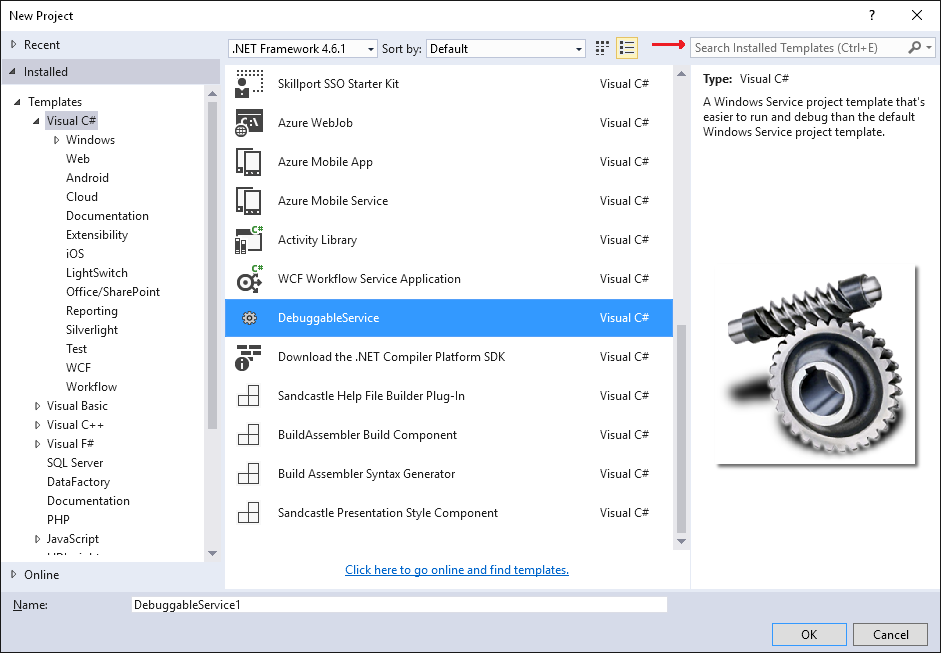

# Debuggable, Self-Installing, Windows Service
A Debuggable, Self-Installing Windows Service Template based on [James Michael Hare](http://geekswithblogs.net/BlackRabbitCoder)'s excellent blogposts:

* [C# Toolbox: A Debuggable, Self-Installing Windows Service Template (1 of 2)](http://blackrabbitcoder.net/archive/2010/09/23/c-windows-services-1-of-2-creating-a-debuggable-windows.aspx)
* [C# Toolbox: A Debuggable, Self-Installing Windows Service Template (2 of 2)](http://blackrabbitcoder.net/archive/2010/10/07/c-windows-services-2-of-2-self-installing-windows-service-template.aspx)

## How to use ##

* Download [the Visual Studio template](https://visualstudiogallery.msdn.microsoft.com/013760d0-d02f-45fe-9fc5-740251e1b30c)
* Create a new project and select / search for `DebuggableService` (see screenshot below)
* Implement any of the provided `OnStart()`, `OnStop()`, `OnPause()`, `OnContinue()`, `OnShutDown()` and `OnCustomCommand()` methods
* Run/debug your application as usual, continue your development cycle as always
* When your application is done, open a console (with Administrative privileges!) and execute `MyApp.exe -install`to install your service; now you can start/stop/pause your service. To uninstall your service simply run `MyApp.exe -uninstall`.

## More ##

The `WindowsService.cs` file contains the `ServiceImplementation` class whichs, as it's name suggests, implements all service methods. This class has been fitted with an `WindowsService` attribute which you can use to control some service-properties like `Name`, `DisplayName`, `Description`, `UserName`, `Password`, `EventLogSource`, `StartMode`, `CanPauseAndContinue`, `CanShutdown`, `CanStop` and services your service depends on via `ServiceDependsOn`.

## But I want more! ##

Sure! No problem. I can recommend the excellent [Topshelf](http://topshelf-project.com/) project, also available as [NuGet package](https://www.nuget.org/packages/Topshelf/). This allows for even more control, has [way better documentation](https://topshelf.readthedocs.org/en/latest/) and is [also available on GitHub](https://github.com/Topshelf/Topshelf)!

## Project status

Works (tested) with:
* Visual Studio 2013
* Visual Studio 2015

